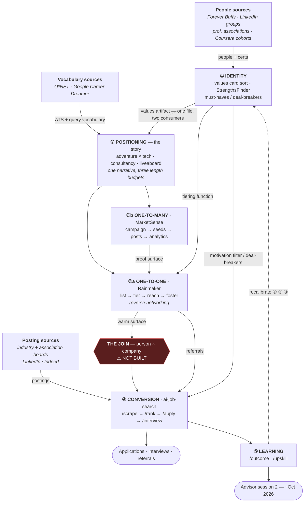

# Job Search Architecture — Level 0

**Status:** working draft · **Last audited:** 2026-07-29

Canonical source for how this fork fits together with the two sibling systems that handle
networking and self-marketing. This repo is the **conversion** stage only; it assumes a posting
already exists. The stages upstream of it live in other repos.

**Provenance:** the advice mapped in this document comes from a CU alumni career advising session
with Sydney (CU Career Services) on 2026-07-29. Transcript and summary:
[Career Development](https://app.notion.com/p/897441123d81489f866dca201e3404ea).

**Repos in scope:**

| System | Repo | Role in this architecture |
|---|---|---|
| ai-job-search (this fork) | `EZ-Walk/ai-job-search` | ④ Conversion, ⑤ Learning |
| Rainmaker | `Staff-Room/rainmaker` | ③a One-to-one networking (contact ledger, cadence) |
| MarketSense | `MarketSense` | ③b One-to-many self-marketing (proof surface) |

---

## The through line

### Why it is shaped this way

1. **This repo is demand-*response*.** Every command downstream of `/scrape` assumes a posting
   exists. Rainmaker and MarketSense are demand-*generation*. That seam is why the repo alone
   plateaus in a saturated market.
2. **Reverse networking is a pipeline inversion, not a tip.** Making the connection *before* the
   posting exists moves the relationship upstream of ④, so applications enter warm. Every other
   networking tactic below is a component that plugs into this inversion.
3. **① is one artifact with two consumers.** The values/strengths output is simultaneously the
   *motivation filter* in `04-job-evaluation.md` (which jobs score high) and the *tiering function*
   in Rainmaker's list (which relationships stay warm). Same file, both systems.
4. **One narrative, three length budgets.** Resume professional summary (what + brief why) →
   cover letter (expanded) → networking/LinkedIn (unbounded). Progressive disclosure of a single
   story, not three different stories.

---

## Advisor input, located by stage

Verdict column: **Signal** = changes the architecture. **Table stakes** = real but generic; encode
once and stop thinking about it. **Demote** = keep, but not for its advertised purpose.

| Stage | Advice | Lands in | Verdict |
|---|---|---|---|
| ① | Free online values card sort; StrengthsFinder (at cost via CU) | `02-behavioral-profile.md` + motivation filters in `04-job-evaluation.md` | **Signal** — gates two subsystems |
| ① | "Dreamer or doer? Is flexibility/freedom core?" | Deal-breakers → `/rank` veto rules | **Signal** |
| ② | Lean into the uniqueness; build a personal brand | The single positioning artifact read by ③a and ③b | Table stakes (thesis confirmed) |
| ② | Resume = summary w/ what+why · cover letter = expand · networking = unlimited | `05-cv-templates.md`, `06-cover-letter-templates.md`, Rainmaker outreach copy | **Signal** — clean length-budget rule |
| ② | O*NET: duties, skills, related occupations, salary by location | ATS keyword mining + `/scrape` query expansion + `salary_lookup.py` | **Demote → repurpose** as vocabulary, not exploration |
| ② | Google Career Dreamer: titles, branding statement, certs | Adjacent-*title* discovery for `/setup --section search` | **Demote** — direction already chosen |
| ③a | **Reverse networking** — connect before a posting exists, then foster | The core Rainmaker loop | **Signal — the architectural insight** |
| ③a | **Forever Buffs** — profiles state *how* they'll help, list direct email, built-in CU common connection | Highest-quality list source for Rainmaker. A *people* board, not a job board | **Signal** — rare low-friction, high-intent database |
| ③a | Prioritize by **value alignment**; read it between the lines of profiles; "what are your top five strengths?" as an opener | Tiering function + discovery questions | **Signal** — answers "which relationships to keep warm" |
| ③a | Professional associations via **JobStars** — events, certs, peers, *and* their own job boards | Feeds ①(certs), ③a(peers/events), ④(boards) | **Signal** — compound channel, best ROI |
| ③a | LinkedIn *groups* beat individual DMs | Channel selection in Rainmaker | **Signal** — cheap to test |
| ③a | Be consistent · keep messages brief · follow up post-meeting · re-touch in 1–2 weeks · lead with the common connection | Cadence rules + outreach templates | Table stakes — the networking clock |
| ③a | Networking is where you show *fit*, not just competence | Discovery + proof surface | Table stakes framing, real function |
| ③b | Coursera cohort as a networking back channel (*Ethan's own find, not advisor's*) | Rainmaker list source; CU Career Academy makes the certs free | **Signal** |
| ④ | Industry-specific job boards are less saturated; Google "\[industry\] job boards", first five results are reliable | A discovery procedure whose output feeds **`/add-portal`** | **Signal** — direct hook into existing scaffold |
| ④ | Apply **early**; postings saturate in hundreds; set an M/W/F schedule | The application clock; raises `/scrape` frequency | **Signal** — trivial to encode |
| ④ | ATS-friendly: no images, logos, odd formatting | `/apply` step 7 already extracts the PDF text layer and checks this | **Already solved** — stronger than Quincy AI |
| ④ | Tech broadly brutal; **tech + healthcare** booming; summer slow | Targeting datapoint (healthcare); rest is weather | **Signal** (healthcare vector only) |
| ⑤ | Quincy AI — one free ATS review; Elsa mock interviews; Copilot | Burn Quincy as an external check on a finished `/apply` resume; `/interview` already covers mocks | Low value, near-zero cost |
| ⑤ | Session 2 in ~2 months: bring a resume draft + report what networking worked | A human review gate on ⑤ | **Signal** — gives the loop a deadline |

### The question the advisor could not answer

Asked whether values/strengths self-assessments are published on Forever Buffs so alums can match
on them: no such thing exists, and she agreed it should. That is a semantic-inference layer over
profile text — infer values/strengths from how someone describes what they will help with, then
rank against the ① artifact. MarketSense-shaped machinery (audience segmentation, semantic
analysis) pointed at people instead of markets. It is the one component that would make ③a's
prioritization non-manual.

---

## Open gaps

### 1. The join — person × company ⚠ not built

The only surviving structural gap. Rainmaker is keyed by contact; this repo's
`job_search_tracker.csv` is keyed by application. Nothing joins them, so `/apply` on Company X
cannot ask *"do we have a warm contact here, and is now the moment to use it?"* — which is the
entire payoff of reverse networking.

Partial precedent already upstream: commit `d1e707e` *(feat(job-scraper): referral-contact
LinkedIn search links for high/medium-fit jobs)* generates referral **search links** per job. That
is the cold version of the same idea. The join would replace a search link with a known contact.

### 2. Job-search variant of the Rainmaker stage enum

Rainmaker's nine stages are deal stages; the terminals differ. A job-search contact does not close
into a signed deal — it terminates in **referral** or **intel**. Needs a variant enum plus mapped
gate questions.

### 3. Value-alignment tiering

Rainmaker tiers by commercial priority. This system needs to tier by values match, which requires
the ① artifact plus the inference layer described above.

### Not gaps (corrected 2026-07-29)

An earlier read of this architecture listed "no contact ledger" and "no cadence discipline" as
gaps. Both are wrong — Rainmaker already specifies and partly runs them
(`Staff-Room/rainmaker`, `docs/architecture.md:330-357`):

- **Contacts DB** — keyed by person + company, with Status (9-stage enum), Priority, Last Contact,
  Next Action + Next Action Date, Trigger Notes, Source/Provenance
- **People DB** — *"the warm network. A person becomes a Contact when commercial context exists"* —
  precisely the reverse-networking staging area
- **Cadence Engine** (Day 0/2/5/9/14), **Decay Detector** (staleness measured *relative to stage*),
  **Trigger Scanner**, and the `log_touch` / `set_next_action` writers

Confirmed live, not just designed: `Today's Queue — 2026-07-15 (claude-code)` pages exist in Notion,
so `emit_queue` has run against real state. The architecture PR is labeled "target state," so some
bindings (n8n cron, Notion Custom Agent) remain ahead.

**Consequence:** the networking build is a **fork of Rainmaker's pipeline**, not a new system.

---

## Build order

1. **① Identity first** (~half a day). Values card sort + strengths. It is the input to both the
   Rainmaker tiering function and the `/rank` deal-breakers; building the networking engine before
   it means hand-tuning priority order forever.
2. **The join.** The gap that actually operationalizes the through line.
3. **Stage enum variant + value-alignment tiering.**

Deferred: per-sibling contract docs under `docs/integrations/` (per the global integration-doc
convention). Held until the join exists — there are no real contracts to inventory yet.
